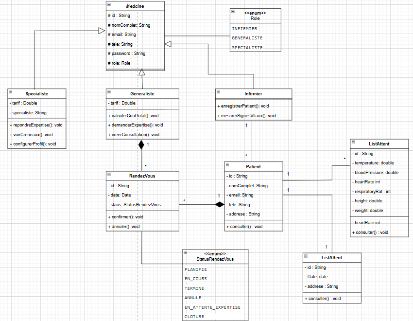
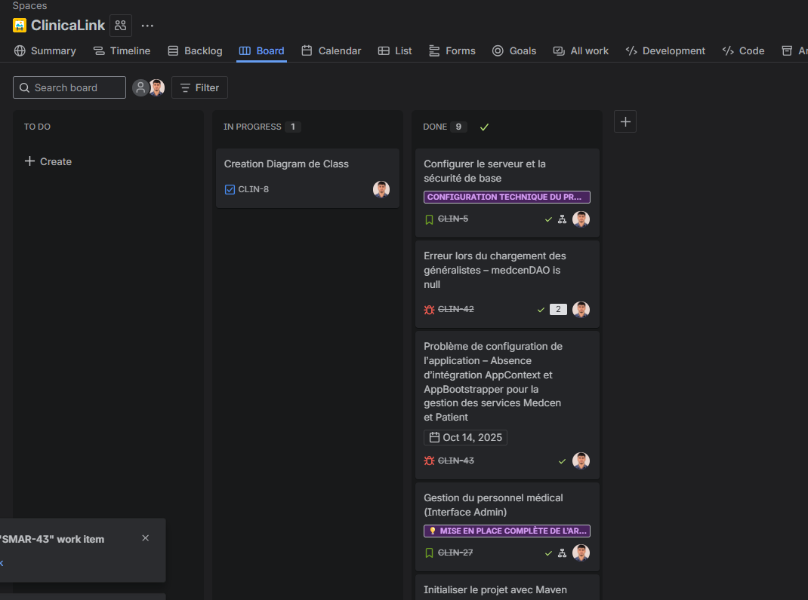

## 🏥 ClinicaLink – Système de Télé-expertise Médicale

### Optimisation du parcours patient et de la coordination médicale via une plateforme Java EE moderne.

-----

## 🌟 Contexte du Projet

Le projet **ClinicaLink** a pour objectif de concevoir et développer un **système de télé-expertise médicale** pour une clinique. Le but est de remplacer les échanges informels par une **solution centralisée** permettant une collaboration structurée et rapide entre le **personnel soignant** (Infirmier, Généraliste) et les **Médecins Spécialistes**.

L'application vise à :

- **Optimiser le parcours patient** en assurant une prise en charge rapide et documentée.
- **Faciliter la coordination** entre le médecin généraliste et le spécialiste.
- **Centraliser** l'enregistrement des patients, des signes vitaux, des consultations et des demandes d'expertise.

Ce système est essentiel pour garantir une **meilleure qualité de soins** grâce à l'avis d'expert à distance.

-----

## 🏛️ Architecture Technique

Ce projet est basé sur l'écosystème **Jakarta EE (anciennement Java EE)** et utilise une approche d'architecture en couches pour la séparation des préoccupations (MVC - Modèle Vue Contrôleur).

- **Couche Présentation (Vue)** : Utilisation de **JSP/JSTL** pour le rendu dynamique des pages et des formulaires.
- **Couche Contrôleur** : Gérée par les **Servlets** pour le traitement des requêtes HTTP et la gestion des sessions utilisateur (Authentication **Stateful**).
- **Couche Service (Métier)** : Contient la logique applicative (validation, règles métier, calcul des coûts, utilisation de **Stream API**).
- **Couche DAO / Repository** : Accès aux données via **JPA/Hibernate** pour la persistance des entités.
- **Sécurité** : Hachage des mots de passe via **Bcrypt** et protection contre les failles **CSRF**.

-----

## 👥 Rôles et Fonctionnalités Implémentées (User Stories)

| Rôle | Entité | Fonctionnalité (User Story) | Description Détaillée |
| :--- | :--- | :--- | :--- |
| **Infirmier** | Patient | **US1 : Accueil du patient** | Enregistrement du patient (Nouveau ou Existant) et saisie des **Signes Vitaux**. Ajout automatique à la **File d'Attente** du généraliste. |
| **Infirmier** | Patient | **US2 : Liste des patients** | Consultation des patients du jour, triés par heure d'arrivée. Filtration par date (**Stream API**). |
| **Généraliste** | Consultation | **US1 : Créer une consultation** | Création du dossier de consultation (motif, observations) avec le patient en file d'attente. Début de la prise en charge. |
| **Généraliste** | Spécialiste | **US3 : Demander une expertise** | Recherche et sélection d'un spécialiste par **Spécialité et Tarif** (**Stream API**). Choix d'un **Créneau disponible**. |
| **Généraliste** | Consultation | **US4 : Voir le coût total** | Calcul automatique du coût (**Lambda/Map().sum()**) : Consultation + Expertise + Actes Techniques (Radiographie, IRM, etc.). |
| **Spécialiste** | Profil | **US5 : Configurer son profil** | Définition de la **Spécialité** et du **Tarif** d'expertise. |
| **Spécialiste** | Créneau | **US6 : Voir ses créneaux** | Affichage des créneaux de 30 min, gestion automatique de la **Disponibilité** (Réservé, Passé, Annulé). |
| **Spécialiste** | Expertise | **US7 : Consulter les demandes** | Liste des demandes reçues, avec filtre par **Statut** (**Stream API**). Accès au dossier patient complet. |
| **Spécialiste** | Expertise | **US8 : Répondre à une expertise** | Saisie de l'**Avis Médical** et des **Recommandations**. Clôture de la demande. |

-----

## 🚀 Technologies Utilisées

| Technologie | Rôle dans le Projet |
| :--- | :--- |
| **Java 17 / Maven** | Langage de base et gestion de projet. |
| **JAKARTA EE / Servlet** | Contrôleurs pour la gestion des requêtes HTTP et des sessions. |
| **JSP / JSTL** | Couche de Présentation (Vue) pour le rendu dynamique. |
| **JPA / Hibernate** | Persistance des données (Entités Patient, Consultation, Expertise...). |
| **Tomcat (ou autre)** | Serveur d'applications Web. |
| **PostgreSQL / MySQL** | Base de données relationnelle. |
| **Bcrypt** | Hachage sécurisé des mots de passe. |
| **Junit / Mockito** | Tests Unitaires et d'Intégration. |

-----

-----

## 💻 Guide de Démarrage

1.  **Prérequis** : Assurez-vous d'avoir Java 17+ et Maven installés.
2.  **Base de données** : Exécutez les **scripts SQL** fournis pour créer la base de données et initialiser le staff (Infirmier, Généraliste, Spécialiste).
3.  **Compilation** :
    ```bash
    mvn clean install
    ```
4.  **Déploiement** : Déployez le fichier **WAR** généré dans le répertoire `target/` sur un serveur **Tomcat** ou équivalent.

-----

## 🗂️ Documentation et Suivi

### 📊 Diagramme UML des Classes
     
### 📋 Suivi de Projet (JIRA/Trello)
        
-----

## 📬 Contact

Pour toute question ou demande de support sur l'exécution du projet, veuillez contacter l'auteur.